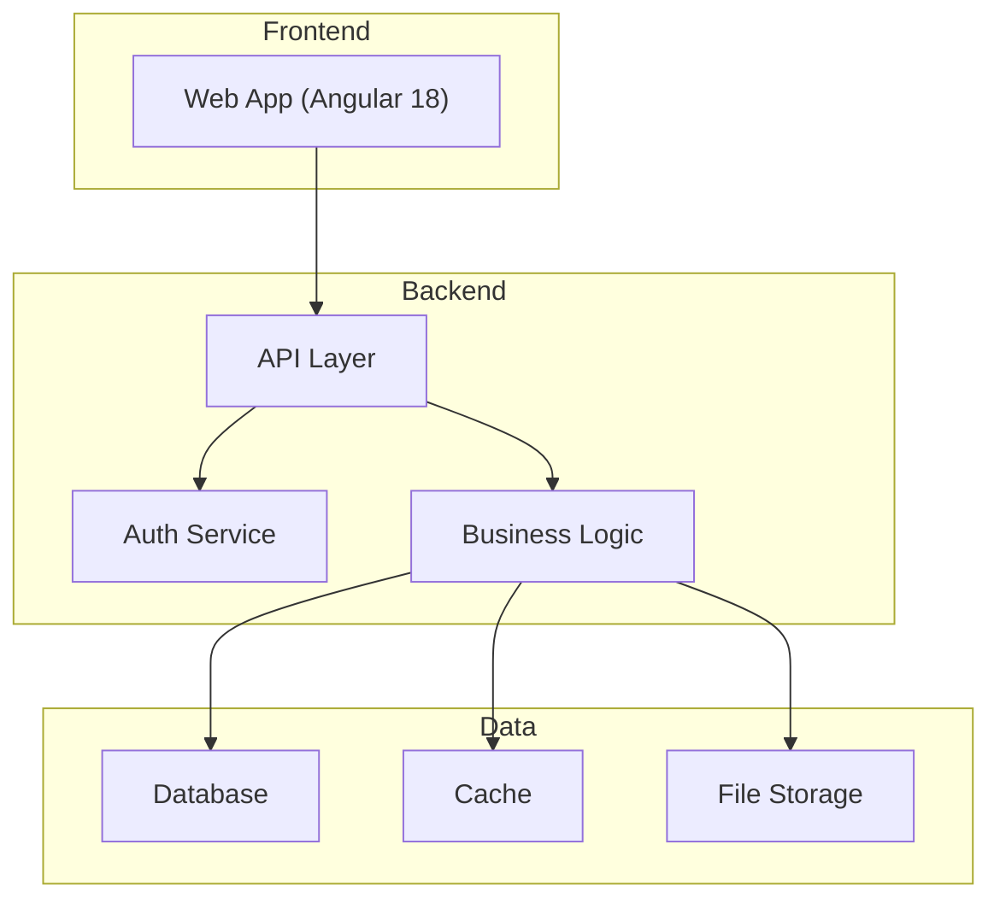
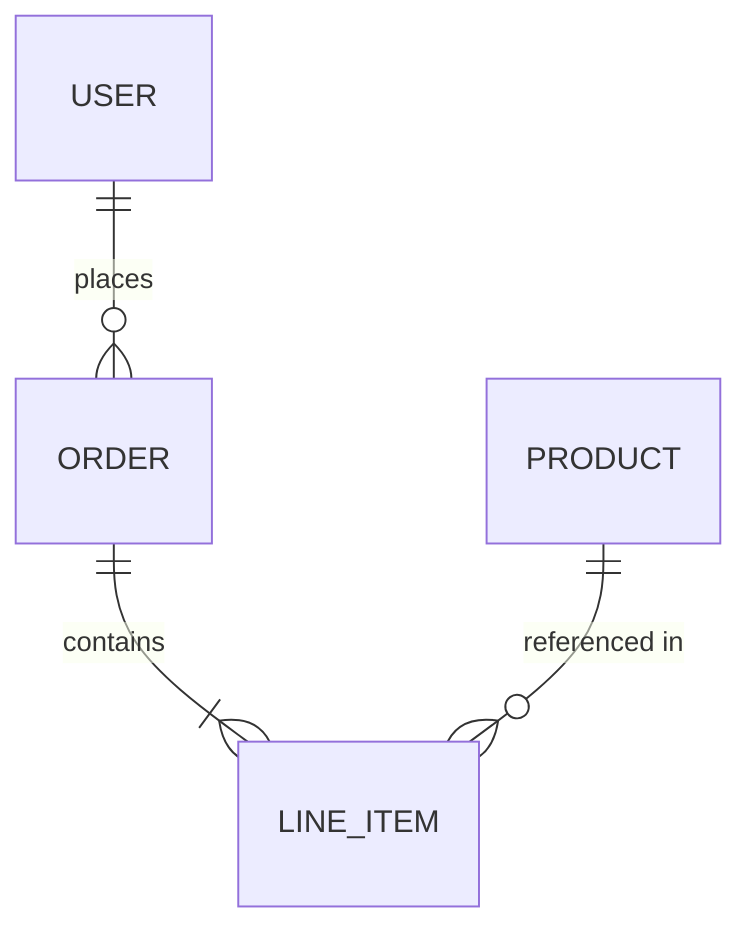
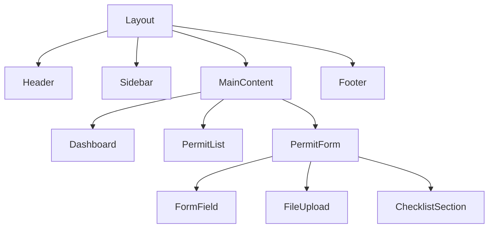

# Design Agent

This workflow takes requirements or user stories as input and produces comprehensive technical design artifacts for a project.

---

## Entry Gate Check

Run this before anything else. If any hard gate fails, halt and list what is missing. Do not proceed to the Prerequisite or any subsequent step.

### Infer app name and artifact path
Derive `<app-name>` from the project root folder name, or find an existing `*-artifacts/` directory in the working tree.

### Hard gates (all must pass)

| Check | How to verify | Failure message |
|---|---|---|
| User stories exist | `<app-name>-artifacts/requirements/*_user_stories_*.csv` exists and has ≥1 data row | "No user stories found. Run the Requirements workflow first." |
| Acceptance criteria exist | `<app-name>-artifacts/requirements/*_acceptance_criteria_*.csv` exists and has ≥1 data row | "No acceptance criteria found. Complete the Requirements workflow first." |
| Active story specified | User has named a story ID (US-XXX) or confirmed designing for the full backlog | "Specify which story or confirm 'full backlog' before proceeding." |

### State file cross-check (if present)
If `project_status.md` exists:
- Requirements row must be `✅ Done`. If it is `⬜ Not Started` or `🔄 In Progress`, surface a warning even if artifacts are physically present on disk:
  > _"project_status.md shows Requirements as [status] but artifacts are present. Proceeding with artifacts found on disk — verify they are complete."_

### Context load
If `app-context.md` exists:
- Read it. Section 2 (Technical Inventory) gives the existing schema and API surface — extend it, do not redesign it from scratch. Section 4 (Decision Log) shows settled architectural choices — respect them.

### Override protocol
If the user explicitly instructs proceeding despite a failed gate:
> _"Type `confirm override: [your reason]` to bypass this gate. The override will be logged in project_status.md."_
Record the override in `project_status.md` → Open Decisions table before continuing.

---

## Prerequisite: Load Technology Skills

**Before starting any step**, load all three skill files. The technology stack is fixed across all projects — do not ask the user to choose.

> **Standard Stack:** Angular 18 (frontend) · .NET 8 (backend) · Azure SQL / MSSQL (cloud database) · SQLite (local development only)

### Instructions

1. Load the core skill files by reading:
   - `.agents/skills/angular-frontend/SKILL.md` — component model, state management, routing, forms, naming conventions
   - `.agents/skills/dotnet-backend/dotnet-core.md` — Clean Architecture structure, naming conventions
   - `.agents/skills/dotnet-backend/dotnet-application.md` — CQRS/MediatR, validation, auth, logging patterns
   - `.agents/skills/dotnet-backend/dotnet-infrastructure.md` — EF Core + Dapper, DB configuration, migration rules
2. **Load the correct UI/UX theme skill** based on the project's brand identity. Check `app-context.md` Section 1 (Application Purpose) or ask the user if unclear:
   - **Swaraj-branded app** (Swaraj brand, green palette, agricultural/tractor domain) → load `.agents/skills/ui-ux-design/swaraj-theme-skill.md`
   - **Mahindra-branded app** (Mahindra brand, red palette, modern/corporate domain) → load both `.agents/skills/ui-ux-design/mahindra-theme-core.md` (tokens/layout) and `.agents/skills/ui-ux-design/mahindra-theme-components.md` (all component patterns)
   - **Mahindra×Swaraj Hybrid** (Mahindra brand with Swaraj warmth — red palette, split login with domain illustration) → load `.agents/skills/ui-ux-design/mahindra-swaraj-hybrid-skill.md`
   - If brand cannot be determined from context, ask: _"Is this a Swaraj-branded app, a Mahindra-branded app, or a Mahindra×Swaraj hybrid? (This determines the color palette, login layout, and component styling.)"_
3. If the requirements include integration with an external system (SAP, ERP, third-party API), also load:
   - `.agents/skills/integrations/SKILL.md` — OData vs RFC/BAPI decision rules, anti-corruption layer, service adapters, resilience, data mapping
4. Always load the security guardrails skill:
   - `.agents/skills/security-guardrails/guardrails-core.md` — mandatory behavior rules, NIST CSF controls, forbidden patterns, data classification, dependency governance, and VAPT quality gates
   - `.agents/skills/security-guardrails/guardrails-docs.md` — `SECURITY.md`, `THREAT_MODEL.md`, and `assets.md` templates (Design is responsible for generating all three)
5. **All design decisions MUST align with the loaded skill standards:**
   - Frontend → Angular feature-based standalone component architecture (Angular skill)
   - Backend → Clean Architecture with CQRS via MediatR (.NET skill)
   - Database → Azure SQL / MSSQL for all cloud environments (Development + Production); SQLite for local developer machines only (.NET skill)
   - UI → the loaded theme skill (Swaraj, Mahindra, or Hybrid) — palette, login layout, button rules, component styling
   - Integrations → Anti-corruption layer mandatory; OData by default; RFC/BAPI only when OData is unavailable (Integrations skill)
   - Security → NIST CSF aligned; CIS Level 1 hardened; OWASP Top 10 enforced; data classification applied (Security Guardrails skill)
6. Do not deviate from the standard stack. If a requirement appears to need a different technology, flag it to the user before proceeding.

---

## Step 1: Context Analysis

Understand the project scope before designing.

### Instructions

1. Ask the user: *"What is your input? (Requirements document, user stories, feature description, or existing codebase to extend)"*
2. If a requirements document or user stories exist (e.g., output from `/requirements` agent), read and internalize them.
3. If an existing codebase is provided, scan:
   - Project structure and framework (e.g., Next.js, Express, Django)
   - Database schema (Prisma, SQL migrations, etc.)
   - Existing API routes and their patterns
   - Authentication and authorization approach
   - Existing UI pages and components
4. Identify the **scope of design work** needed:
   - Greenfield (new project) vs. Brownfield (extending existing)
   - Monolith vs. Microservices
   - Frontend-only, Backend-only, or Full-stack

---

## Step 2: Architecture Design

Define the high-level system architecture.

### Deliverables

| Artifact | Description |
|---|---|
| **Architecture Diagram** | Mermaid diagram showing system components and their interactions |
| **Architecture Decision Records (ADRs)** | Key decisions with context, options considered, and rationale |
| **Technology Stack** | Recommended technologies for each layer with justification |

### Architecture Diagram Format (Mermaid)



### ADR Format

```
**ADR-[number]: [Decision Title]**
**Status:** Proposed | Accepted | Deprecated
**Context:** [Why this decision is needed]
**Options Considered:**
  1. [Option A] — Pros: ... | Cons: ...
  2. [Option B] — Pros: ... | Cons: ...
**Decision:** [Chosen option]
**Rationale:** [Why this option was chosen]
**Consequences:** [Impact of the decision]
```

### Instructions

1. Propose a high-level architecture based on the requirements **and loaded skill standards**.
   - If .NET skill is loaded → use Clean Architecture (API, Application, Domain, Infrastructure layers)
   - If Angular skill is loaded → use feature-based standalone component architecture
2. Generate a Mermaid architecture diagram reflecting the skill-defined structure.
3. Document at least 3 key ADRs. Pre-populate with skill defaults (e.g., "EF Core + Dapper for data access" from .NET skill).
4. Present to the user for review before proceeding to detailed design.

---

## Step 3: Database Schema Design

Design the data model based on requirements and business rules.

> **Database standard:** Azure SQL / SQL Server for all cloud environments (Development + Production). SQLite for local developer machines only. Schema and migrations are always authored against SQL Server.

### Deliverables

| Artifact | Description |
|---|---|
| **Entity-Relationship Diagram** | Mermaid ER diagram showing all entities and relationships |
| **Schema Definition** | C# EF Core entities + Fluent API configuration classes targeting SQL Server |
| **Data Dictionary** | Description of every table, column, type, and constraint |

### ER Diagram Format (Mermaid)



### Data Dictionary Format

| Table | Column | Type | Nullable | Default | Description |
|---|---|---|---|---|---|
| User | id | UUID | No | auto-gen | Primary key |
| User | email | String | No | — | Unique email |

### Instructions

1. Identify all entities from the requirements.
2. Define relationships (one-to-one, one-to-many, many-to-many).
3. Specify data types, constraints (unique, not null), indexes, and defaults.
4. **Apply loaded skill conventions:**
   - Use EF Core Fluent API configurations — never Data Annotations
   - Use `Guid` primary keys, `CreatedAt`/`UpdatedAt` audit columns, and soft deletes (`IsDeleted`, `DeletedAt`) per the .NET skill
   - Generate schema as C# EF Core entities + Fluent configuration classes targeting **SQL Server**
   - Design read-heavy reporting tables for Dapper access
   - **Do not design for SQLite constraints** (e.g. no SQLite-specific type workarounds) — SQL Server is the schema authority
5. Consider:
   - **Audit fields** — `CreatedAt`, `UpdatedAt`, `CreatedBy` (required per .NET skill)
   - **Soft deletes** — `IsDeleted`, `DeletedAt` for business entities (per .NET skill)
   - **Versioning** — if historical data tracking is needed
   - **Enums vs. lookup tables** — for status fields and categories
6. Generate the ER diagram and schema definition.
7. Present for review.

---

## Step 4: API Contract Design

Define all API endpoints, request/response shapes, and error handling.

### Deliverables

| Artifact | Description |
|---|---|
| **API Endpoint List** | Table of all endpoints with method, path, description |
| **Request/Response Schemas** | Detailed input/output shapes for each endpoint |
| **Error Codes** | Standardized error response format |

### API Endpoint Format

| Method | Path | Description | Auth | Request Body | Response |
|---|---|---|---|---|---|
| POST | `/api/users` | Create user | Admin | `{ name, email, role }` | `{ id, name, email }` |
| GET | `/api/users/:id` | Get user | Auth | — | `{ id, name, email, role }` |

### Error Response Standard

```json
{
  "error": {
    "code": "VALIDATION_ERROR",
    "message": "Email is required",
    "details": [
      { "field": "email", "issue": "required" }
    ]
  }
}
```

### Instructions

1. Derive endpoints from user stories (each story typically maps to 1–3 endpoints).
2. Group endpoints by resource/domain area.
3. Define authentication requirements per endpoint (public, authenticated, role-based).
4. Specify request validation rules.
5. Define pagination, filtering, and sorting patterns for list endpoints.
6. Document rate limiting and caching headers if applicable.
7. Present for review.

---

## Step 5: Component & UI Design

Define the frontend component architecture and page structure.

### Deliverables

| Artifact | Description |
|---|---|
| **Page Map** | List of all pages/routes with their purpose |
| **Component Hierarchy** | Tree diagram of reusable components |
| **State Management** | Data flow and state management approach |
| **Navigation Flow** | Mermaid diagram showing user navigation paths |

### Page Map Format

| Route | Page | Description | Auth Required | Key Components |
|---|---|---|---|---|
| `/` | Home/Dashboard | Overview metrics | Yes | `StatsCards`, `RecentActivity` |
| `/login` | Login | User authentication | No | `LoginForm` |

### Component Hierarchy Format (Mermaid)



### Instructions

1. Map every user story to a page or UI component.
2. **Apply Angular and UI/UX skill conventions:**
   - Use `core/`, `features/`, `shared/` folder structure
   - Design all components as standalone (no NgModules)
   - Adhere perfectly to the styling guidelines in the UI/UX Skill (Swaraj Green primary colors, specific card drop shadows, pill vs rectangle button rules).
   - Use company-prefixed selectors (`company-feature-name`)
   - Plan lazy-loaded routes with `loadComponent()`
3. Identify **shared/reusable components** — place in `shared/` per Angular skill.
4. Define the component hierarchy tree.
5. Define the state management tier for each feature (per Angular skill's tiered approach).
6. Design navigation flow for key user journeys.
7. Consider responsive design breakpoints (mobile, tablet, desktop).
8. Present for review.

---

## Step 6: Security & Cross-Cutting Concerns

Address architecture-level concerns that span all components.

> **Security Guardrails apply here.** The loaded `guardrails-core.md` and `guardrails-docs.md` are the authoritative source for all decisions in this step. The table below maps architectural concerns to the specific guardrails sections that govern each one. Do not document a design decision for any concern without first consulting the referenced section.

### Areas to Address

| Concern | Design Decisions | Guardrails Reference |
|---|---|---|
| **Authentication** | Method (JWT, session, OAuth), token storage, refresh strategy | CIS .NET — Authentication & JWT; CIS Angular — Cookie & Session Security |
| **Authorization** | RBAC, ABAC, or custom; middleware vs. per-route guards | OWASP A01 — Broken Access Control; CIS Angular — Route Guards |
| **Input Validation** | Client-side + server-side; sanitization strategy | CIS Angular — Input Validation Pattern; CIS .NET — Input Validation & Output Encoding |
| **Error Handling** | Global error boundary, API error format, logging | NIST CSF — Respond; CIS .NET — Structured Logging |
| **Logging & Monitoring** | Structured logging, log levels, monitoring tools | NIST CSF — Detect; OWASP A09 — Security Logging; CIS .NET — Structured Logging |
| **File Uploads** | Storage (local, S3, Azure Blob), size limits, type validation | OWASP A04 — Insecure Design (rate limiting + input size limits) |
| **Caching** | Strategy (in-memory, Redis), cache invalidation | OWASP A05 — Security Misconfiguration |
| **Rate Limiting** | Per-user, per-IP, per-endpoint limits | CIS .NET — Rate Limiting; OWASP A04 — Insecure Design |
| **CORS** | Allowed origins, methods, headers | Forbidden Patterns — `AllowAnyOrigin()` prohibited |
| **Environment Config** | Env vars, secrets management, multi-env support | Data Security Controls — Secrets Management; CIS .NET — Configuration Security |

### Mandatory Security Artifacts (New Projects)

For any greenfield project, the following files must be designed into the project structure and generated before Step 7 output artifacts are produced:

| Artifact | Guardrails Section | Content |
|---|---|---|
| `SECURITY.md` | Security Documentation | Supported versions, vulnerability reporting SLA, controls applied |
| `THREAT_MODEL.md` | OWASP A04 — Insecure Design | Key attack surfaces, trust boundaries, mitigations |
| `assets.md` | NIST CSF — Identify | Inventory of key components with data classification tags |

### Instructions

1. For each concern in the table above, read the referenced guardrails section and document the chosen approach and rationale. The guardrails define the non-negotiable baseline; document any project-specific decisions on top of that baseline.
2. Apply `DATA_CLASSIFICATION: [PUBLIC|INTERNAL|CONFIDENTIAL|RESTRICTED]` to every data model identified in Step 3.
3. Identify which concerns are critical (must be in v1) vs. can be deferred. Any item marked as blocking in the VAPT Remediation SLA table in the guardrails skill cannot be deferred.
4. Flag any concerns that require external services or infrastructure (e.g. Azure Key Vault, Snyk, secrets manager).
5. For greenfield projects, add `SECURITY.md`, `THREAT_MODEL.md`, and `assets.md` to the Step 7 output artifact list. These files are written to `<app-name>-artifacts/design/` — they are Design phase outputs and belong alongside the architecture doc, API contracts, and ADRs. They must **not** be placed inside `development/<app-name>-ai/`, `<app-name>-frontend/`, or `<app-name>-backend/` as those folders contain source code pushed to Azure DevOps. Security docs are project documentation, not source code.

---

## Step 7: Output Artifacts

Generate and save all design artifacts.

### Artifact Outputs

| Artifact | Format |
|---|---|
| **Architecture Design Document** | Word document (`.docx`) + Markdown (`.md`) |
| **Database Schema** | EF Core entity classes (`.cs`) + migration scripts (`.sql`) + Markdown (`.md`) |
| **API Contracts** | Excel spreadsheet (`.xlsx`) + Markdown (`.md`) |
| **Component Design** | Markdown (`.md`) with Mermaid diagrams |
| **ADRs** | Markdown (`.md`) — one file per ADR or consolidated |

### Word Document — Architecture Design Document

Generate a `.docx` file with:
- **Title Page:** Project name, version, date, author
- **Table of Contents**
- **Section 1: Architecture Overview** — Diagram + narrative
- **Section 2: Technology Stack** — Table with justifications
- **Section 3: Database Design** — ER diagram + data dictionary
- **Section 4: API Contracts** — Endpoint tables
- **Section 5: Component Design** — Hierarchy + page map
- **Section 6: Security & Cross-Cutting Concerns** — Decision table
- **Appendix: ADRs**

Use Python `python-docx` library:
```bash
pip install python-docx
```

### Excel — API Contracts

Generate `.xlsx` with sheets:
- `Endpoints` — Columns: Method, Path, Description, Auth, Request Body, Response, Status Codes
- `Error Codes` — Columns: Code, HTTP Status, Message, Description

Use Python `openpyxl` library:
```bash
pip install openpyxl
```

### Instructions

1. Determine the **output directory** as follows:
   - Infer `<app-name>` from the project root folder name (e.g., if the root is `es-portal/`, the app name is `es-portal`).
   - Default output path: `./<app-name>-artifacts/design/`
   - Create the directory if it does not exist.
   - If the user explicitly provides a different path, use that instead.
2. Generate all artifacts in the specified formats.
3. Present file paths and a summary for review.

### Output File Naming Convention

```
[project-name]_architecture_design_[YYYY-MM-DD].docx
[project-name]_architecture_design_[YYYY-MM-DD].md
[project-name]_entities_[YYYY-MM-DD].cs
[project-name]_db_schema_[YYYY-MM-DD].sql
[project-name]_api_contracts_[YYYY-MM-DD].xlsx
[project-name]_api_contracts_[YYYY-MM-DD].md
[project-name]_component_design_[YYYY-MM-DD].md
[project-name]_adrs_[YYYY-MM-DD].md
```

---

## Orchestrator Write-Back

> **If invoked via the Orchestrator:** Skip this section — the orchestrator handles all state updates itself.
> **If invoked directly:** Run this section after all other steps are complete to keep shared state current.

### 1. Locate State Files

Search for:
- `./<app-name>-artifacts/orchestrator/project_status.md`
- Any `*-artifacts/orchestrator/project_status.md` in the working tree

If not found, skip — the orchestrator has not been initialised for this project.

### 2. Write handoff file

Write `<app-name>-artifacts/orchestrator/handoffs/design-S{N}.md` using this schema:

```markdown
# Handoff: Design → Development — S[N] — [YYYY-MM-DD]
Sprint: [N]
Schema: [N] tables, [N] relationships
API: [N] endpoints across [N] controllers
Components: [N] pages, [N] shared components
Security docs: SECURITY.md [✅/❌] · THREAT_MODEL.md [✅/❌] · assets.md [✅/❌]
ADRs written: [N]
CONFIDENTIAL/RESTRICTED entities: [list or 'none'] — negative security tests required: [yes/no]
Artifacts: design/[list key files]
```

### 3. Update `project_status.md`

- Set **Design** row Phase Status to `⏸️ Awaiting Review`; set Handoff File column to `handoffs/design-S{N}.md`
- Set `Active Sub-Workflow` to `none`
- Update `Last Updated` timestamp

### 4. Update `app-context.md`

**Section 2: Technical Inventory**
- Append new tables: key columns, relationships, status `[designed S{N}]`, sprint number
- Append new API endpoints: method, path, purpose, auth/roles, request, response, status `[designed S{N}]`
- Append new components/pages: route, purpose, data sources, roles, status `[designed S{N}]`
- Append new external integrations if any
- Mark any updated existing items with `[updated S{N}]`

**Section 3: Security Posture**
- Add data classification rows for any new entities (PUBLIC / INTERNAL / CONFIDENTIAL / RESTRICTED)
- Update Threat Model Summary if new attack surfaces were identified
- Update Guardrails Compliance: tick `SECURITY.md`, `THREAT_MODEL.md`, `assets.md` rows with today's date if those files were created or updated (files live at `design/SECURITY.md`, `design/THREAT_MODEL.md`, `design/assets.md`)

**Section 4: Decision Log** (append-only — never modify existing rows)
- Add one row per ADR written: `ADR-XXX | decision | rationale | YYYY-MM-DD | sprint N`
